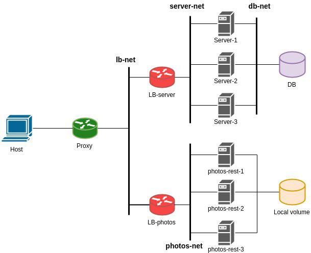

# docker-cdspgram

High availability system whith [CDPSGram server] and [CDPSGram photos] servers.

## System Diagram

The system consists on the following containers:

+ Proxy: NGINX as firewall and reverse proxy.
+ LB-server: HAPROXY as LB from the server service
+ LB-photos: HAPROXY as LB from the photos rest service.
+ Server: NodeJS server.
+ photos-rest: NodeJS REST server.
+ DB: MongoDB database.

[CDPSGram server]:https://github.com/aalonsog/CDPSgram-server
[CDPSGram photos]:https://github.com/aalonsog/CDPSgram-photos
